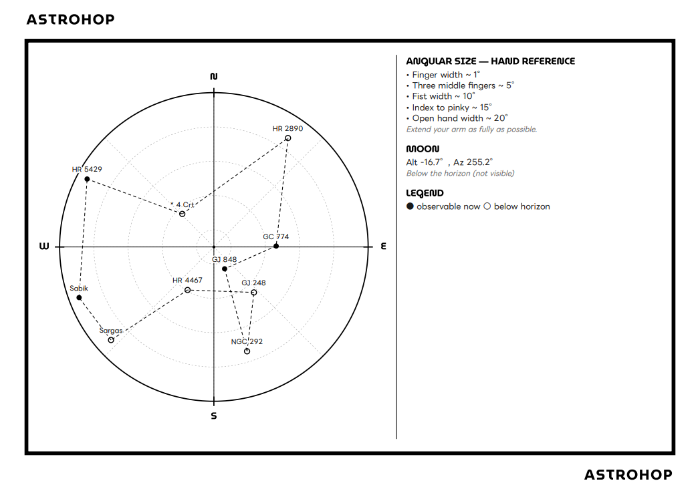

# Astrohop

A web app designed for planning stargazing sessions and generating printed field maps for them.

# Features

- Selection of more than 300k objects from the SIMBAD database

- Generation of the shortest tour between all objectives for a step-by-step observation session

- Moon position

- Useful tips and data printed directly on the map